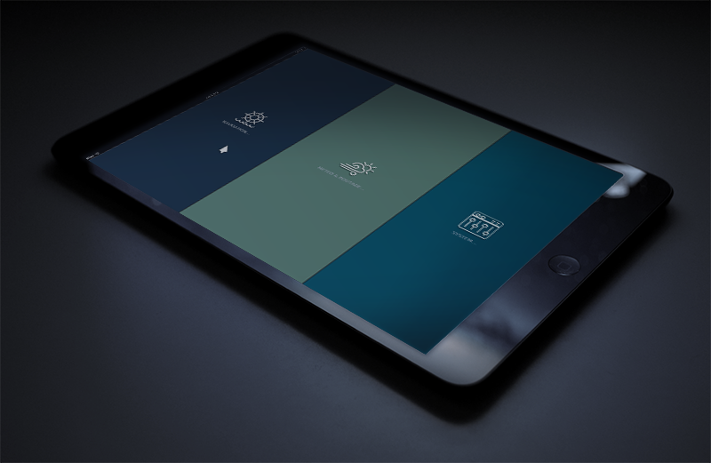

# OPLauncher

OPLauncher is a modified & adapted version of PiMenu by splitbrain: https://github.com/splitbrain/pimenu
To be used with Openplotter by Sailoog: https://openmarine.net/openplotter
IMPORTANT: For the "Desktop" button to work you need to have xdotool installed: https://github.com/jordansissel/xdotool

This is a simple fullscreen menu system written in Python TKInter. 
It has been developed with a Raspberry Pi Touchscreen in mind
and is optimized for medium screens (800x600 is assumed) or remote tablet display.

Tiles are configured in `oplauncher.yaml`, they can either open new pages of tiles 
or execute the action script `oplauncher.sh` to execute arbitrary tasks.

On the Raspberry, install python-yaml:

```bash
sudo apt-get install python-yaml
```

The app can be started in fullscreen by passing `fs` as first parameter.

```bash
./oplauncher.py fs
```



OPLaucher is under [MIT licence](LICENSE) and is a fork from [pimenu.md by Andreas Gohr](https://github.com/splitbrain/pimenu)

## Icons

The install comes wih a bunch of icons with their own licenses.
Most icons modified & adapted from noun project: https://thenounproject.com/

